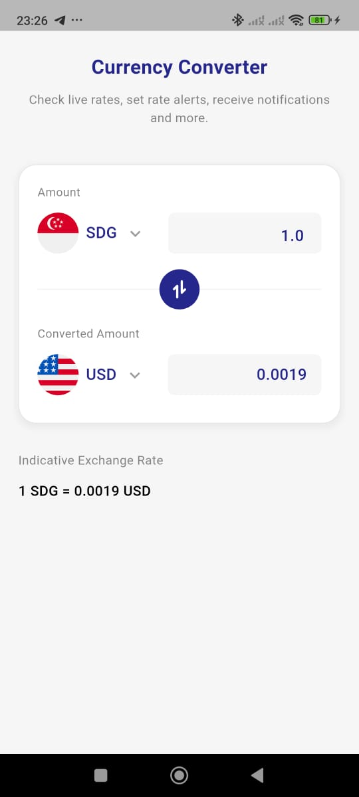
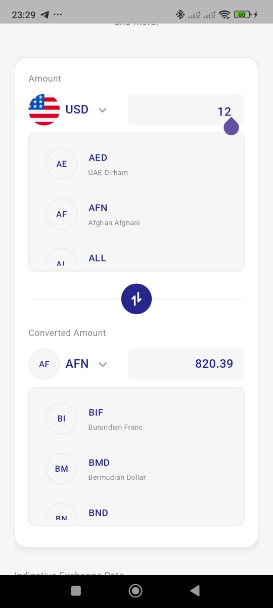
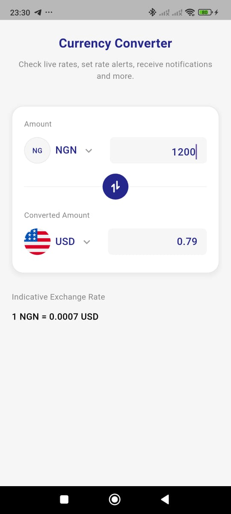

# Currency Converter App

A clean and simple currency converter app built with Flutter, following Clean Architecture principles and MVVM pattern.

## Tech Stack

- **Flutter SDK**: Latest stable version  
- **State Management**: Riverpod  
- **HTTP Client**: dart:http  
- **Architecture**: Clean Architecture + MVVM  
- **Design Principles**: DRY, KISS and SOLID  


## Features

- Real-time currency conversion using ExchangeRate-API
- 170+ currencies listed
- Swap currencies with one tap
- Clean, intuitive UI 
- Fast and responsive with minimal dependencies

## Project Structure

lib/
├── main.dart
├── core/
│   ├── constants/        # API constants
│   ├── errors/          # Error handling
│   └── utils/           # Extensions & utilities
├── data/
│   ├── models/          # Data models
│   ├── repositories/    # Repository implementations
│   └── datasources/     # Remote data sources
├── domain/
│   ├── entities/        # Business objects
│   ├── repositories/    # Repository contracts
│   └── usecases/        # Business logic
└── presentation/
    ├── pages/           # UI screens
    ├── widgets/         # Reusable components
    ├── viewmodels/      # State management
    └── providers/       # Riverpod providers

## Getting Started

### Prerequisites
- Flutter SDK (latest stable)  
- Dart SDK  
- IDE (VS Code / Android Studio)  


### Installation
1. Clone the repository:
   ```bash
   git clone https://github.com/yourusername/currency_converter.git
   cd currency_converter  

  ```bash
flutter pub get
  ```

  ```bash
flutter run
```

### Screenshots









### API Integration

The app uses ExchangeRate-API with two main endpoints:
1. **Get Currencies**: `/v6/{API_KEY}/codes`
   * Fetches all supported currency codes and names
2. **Convert Currency**: `/v6/{API_KEY}/pair/{from}/{to}`
   * Gets real-time exchange rate between two currencies

### Complied to the following requirements.

- **Flutter**: Latest version used 
- **State Management**: Riverpod implemented 
- **Architecture**: Clean Architecture + MVVM 
- **Code Quality**: DRY and KISS principles applied 
- **API Integration**: ExchangeRate-API endpoints used  
- **Error Handling**: comprehensive and detailed error management 